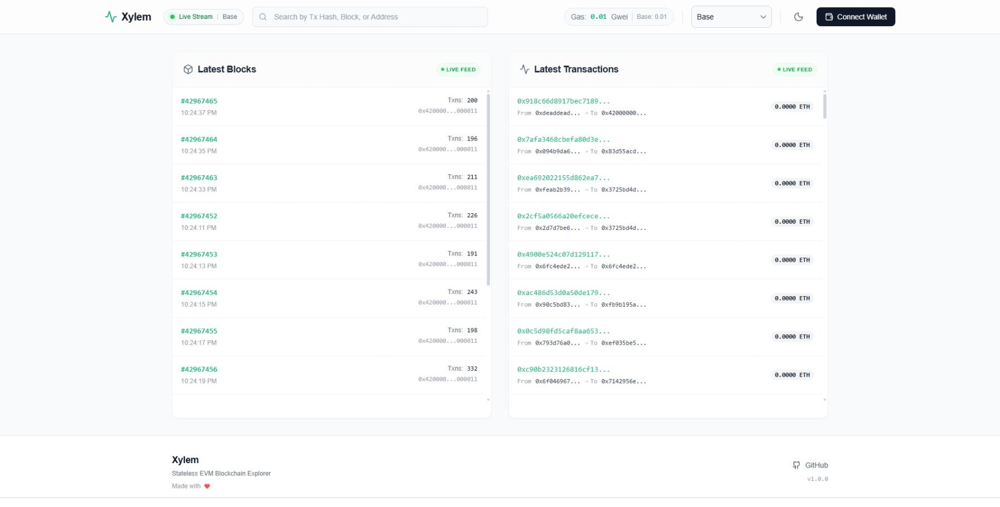

# Xylem

<p align="center">
  
</p>
<p align="center">
  <a href="https://github.com/arifintahu/xylem/stargazers"></a>
  <a href="LICENSE"></a>
</p>

A highly responsive, serverless EVM blockchain explorer that operates entirely in the browser.



> **Just as xylem tissue transports nutrients directly from a plant's roots to its leaves, this application connects directly to JSON-RPC and WebSocket (WSS) endpoints, bypassing centralized indexers entirely.**

Xylem provides developers with a minimalist, clean, and unfiltered way to stream live blocks, inspect transactions, and monitor network health in real-time. It is designed as a **stateless, backendless EVM explorer**, ensuring privacy and direct interaction with the blockchain.

## Features

-   **Stateless & Backendless**: Connects directly to RPC nodes; no intermediary servers or databases.
-   **Real-time Updates**: Live streaming of blocks and transactions.
-   **Block Explorer**: View detailed block information, including gas usage, miner details, and transaction lists.
-   **Transaction Details**: Inspect transaction status, value, and gas fees.
-   **Address Details**: Check wallet balances, transaction counts, and contract bytecode.
-   **Multi-Network Support**: Easily switch between supported networks.
-   **Global Search**: Quickly find blocks, transactions, or addresses.
-   **Gas Tracker**: Monitor current gas prices.

## Configuration

Xylem can be configured in two ways:
1.  **Environment Variables**: For single-chain deployments or quick setups.
2.  **`config/config.json`**: For multi-chain support and advanced configuration.

### 1. Environment Variables (Single Chain)

Create a `.env` file in the root directory (copy from `.env.example`):

| Variable | Description | Default (Sepolia) |
|----------|-------------|-------------------|
| `VITE_CHAIN_ID` | The Chain ID of the network | `11155111` |
| `VITE_CHAIN_NAME` | The display name of the network | `Sepolia` |
| `VITE_CHAIN_RPC_URL` | The HTTP JSON-RPC endpoint | `https://rpc.sepolia.org` |
| `VITE_CHAIN_WS_URL` | The WebSocket (WSS) endpoint | `wss://rpc.sepolia.org` |
| `VITE_CHAIN_SYMBOL` | The native currency symbol | `ETH` |
| `VITE_CHAIN_BLOCK_EXPLORER_URL` | URL to an external block explorer (optional) | `https://sepolia.etherscan.io` |

**Note**: Since Xylem is a client-side application, these variables are embedded into the build. You must provide them at build time.

### 2. `config.json` (Multi-Chain)

To support multiple networks, create a `config/config.json` file. You can use `config/config.json.template` as a starting point.

```json
{
    "networks": [
        {
            "id": 1,
            "name": "Ethereum",
            "rpcUrl": "https://eth.merkle.io",
            "wsUrl": "wss://eth.merkle.io",
            "currency": {
                "name": "Ether",
                "symbol": "ETH",
                "decimals": 18
            },
            "blockExplorerBaseUrl": "https://etherscan.io"
        },
        {
            "id": 8453,
            "name": "Base",
            "rpcUrl": "https://mainnet.base.org",
            "wsUrl": "wss://base-rpc.publicnode.com",
            "currency": {
                "name": "Ether",
                "symbol": "ETH",
                "decimals": 18
            },
            "blockExplorerBaseUrl": "https://basescan.org"
        }
    ]
}
```

If `config.json` is present, it will be loaded alongside any environment variables. If both are present, the environment variables will be added as an additional network (if valid).

## Deployment

<details>
<summary><strong>Docker</strong></summary>

You can deploy using Docker with either environment variables or by mounting a `config.json` file.

**Option 1: Using Environment Variables (Single Chain)**

```bash
# Build the Docker image
docker build \
  --build-arg VITE_CHAIN_ID=1 \
  --build-arg VITE_CHAIN_NAME="Ethereum Mainnet" \
  --build-arg VITE_CHAIN_RPC_URL="https://eth.merkle.io" \
  --build-arg VITE_CHAIN_WS_URL="wss://eth.merkle.io" \
  --build-arg VITE_CHAIN_SYMBOL="ETH" \
  -t xylem-explorer .

# Run the container
docker run -p 8080:80 xylem-explorer
```

**Option 2: Using `config.json` (Multi-Chain)**

1.  Create your `config/config.json` file.
2.  Build the image (no build args needed for config.json support, but the file must be present at build time).

```bash
# Copy config.json to config/config.json before building
cp config/config.json.template config/config.json

# Build
docker build -t xylem-explorer .

# Run
docker run -p 8080:80 xylem-explorer
```

The application will be available at `http://localhost:8080`.

</details>

<details>
<summary><strong>Vercel</strong></summary>

Xylem is optimized for Vercel deployment. **Vercel deployments primarily support Environment Variables configuration.**

1.  **Install Vercel CLI**:
    ```bash
    npm i -g vercel
    ```

2.  **Deploy**:
    Set the environment variables in the Vercel Dashboard or `vercel.json` (not recommended for secrets) before deploying.
    ```bash
    vercel --env VITE_CHAIN_RPC_URL="https://..." --env VITE_CHAIN_ID=1 ...
    ```

Alternatively, push to GitHub and connect your repository to Vercel for automatic deployments. A `vercel.json` is included for configuration.

</details>

<details>
<summary><strong>Nginx</strong></summary>

To deploy manually with Nginx, you can use either method.

**Option 1: Build with Environment Variables**

```bash
# Export variables
export VITE_CHAIN_ID=1
export VITE_CHAIN_NAME="Ethereum"
# ... other variables

# Build
npm run build
```

**Option 2: Build with `config.json`**

1.  Ensure `config/config.json` exists and contains your network configuration.
2.  Build the project:
    ```bash
    npm run build
    ```

**Then serve with Nginx:**

1.  **Configure Nginx**:
    Use the provided `nginx.conf` as a template. Copy it to `/etc/nginx/sites-available/xylem` and symlink to `sites-enabled`.

2.  **Copy files**:
    Copy the contents of the `dist` folder to your Nginx root (e.g., `/var/www/xylem`).

</details>

<details>
<summary><strong>Caddy</strong></summary>

Caddy is a modern web server that is easy to configure and use. A `Caddyfile` is provided for quick deployment.

1.  **Build the project**:
    Configure your environment variables or `config.json` as described above, then run the build command:
    ```bash
    npm run build
    ```
    This command generates a `dist` folder in the project root containing the production build.

2.  **Serve with Caddy**:
    Ensure you have [Caddy installed](https://caddyserver.com/docs/install).
    
    Make sure the `Caddyfile` and the `dist` folder are in the same directory.
    
    Run the following command in that directory:
    ```bash
    caddy run
    ```
    The application will be available at `http://localhost`.

</details>

## License

This project is licensed under the MIT License - see the [LICENSE](LICENSE) file for details.
